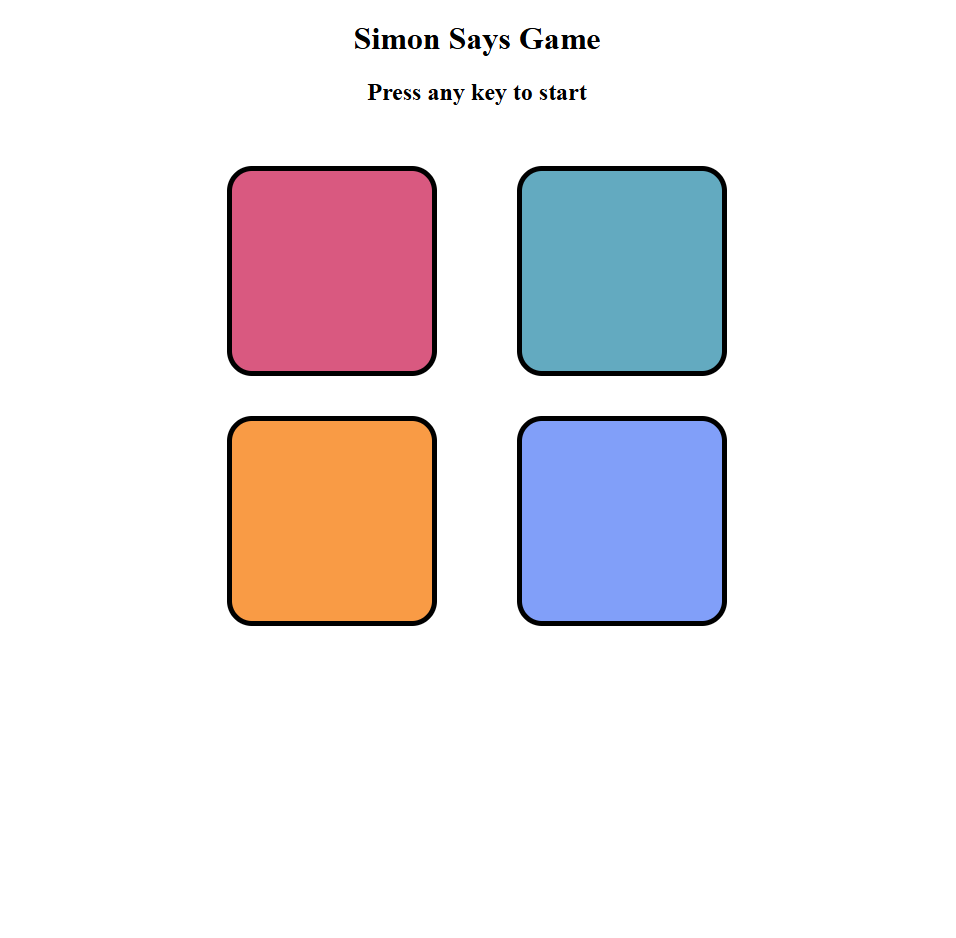

# 🎮 Simon Says Game

A fun and interactive memory-based game built with **HTML**, **CSS**, and **JavaScript**. The objective is to repeat the sequence of colors generated by the computer. Each level adds a new color to the sequence, testing your memory as the game progresses.

## 🚀 Features

- Interactive and responsive UI
- Random color sequence generation
- Level progression system
- Game over feedback and score display
- Clean, modular code for easy customization

## 🖥️ Demo

  
> 
Deployed Link: https://iadnanimam.github.io/Simon-game/
---

## 🧠 How to Play

1. **Press any key** to start the game.
2. **Watch the sequence** of button flashes.
3. **Repeat the sequence** by clicking the buttons in the same order.
4. If you succeed, the game progresses to the next level with a longer sequence.
5. If you make a mistake, the game ends and your score is shown.

---

## 🛠️ Technologies Used

- HTML5
- CSS3
- JavaScript (Vanilla JS)

---

## 🔧 How to Run Locally

1. Clone the repository:
   ```bash
   git clone https://github.com/iAdnanImam/simon-game.git
   ```
2. Navigate to the project folder:
   ```bash
   cd simon-game 
3.Open index.html in your browser.
   

